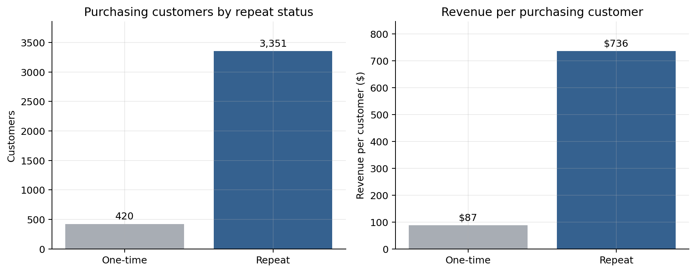
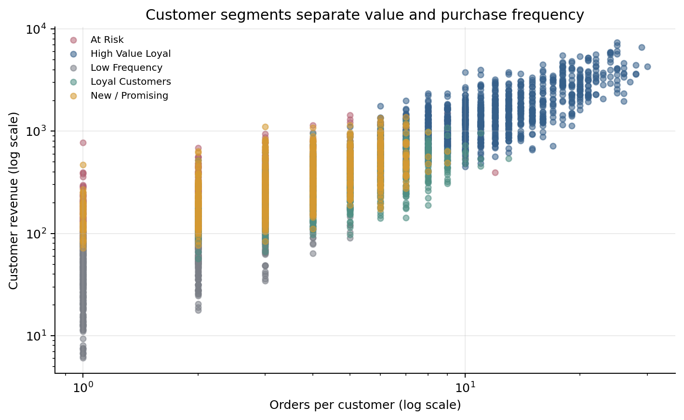

# E-commerce Customer Intelligence

**Customer Behavior • Segmentation • Repurchase Prediction • Product Recommendation**

## Business Problem

This compact case study asks seven practical questions: What is happening in the business? How do customers behave? Who are the customers? When might they buy again? What should we recommend? What action should the business take? Did that action work? The project answers them with SQL, descriptive analytics, machine learning, and an experimentation-oriented business interpretation.

## End-to-End Workflow

```text
E-commerce Transactions
        ↓
SQL Feature Engineering
        ↓
Business KPIs
        ↓
Customer Behavior Analysis
        ↓
Customer Segmentation
        ↓
Repurchase Prediction
        ↓
Product Recommendation
        ↓
Business Action
        ↓
Monitoring / A-B Testing
```

## Synthetic Dataset

All data is **synthetic and generated specifically for demonstration and interview purposes**. The deterministic generator creates 4,000 fictional customers, 180 products, 22,373 orders, and 52,993 order items covering January 2024–December 2025. No private, client, or real-company data is included, and none of the results should be interpreted as real company performance.

**Tech stack:** Python, SQL, Pandas, NumPy, scikit-learn, Matplotlib, SQLite, and Jupyter.

## Customer Behavior Analysis

Descriptive analysis comes before machine learning:

- Of 3,771 purchasing customers, 420 are one-time purchasers and 3,351 are repeat purchasers—a repeat rate of 88.9%.
- Repeat customers contribute 98.5% of synthetic revenue and average $736 revenue per customer, compared with $87 for one-time customers.
- The median purchasing customer places 4 orders; repeat customers have a median inter-purchase interval of 54.3 days.
- 1,484 customers (39.4%) purchased in the last 45 days, while 1,147 (30.4%) have been inactive for more than 180 days.
- Observed revenue per acquired customer ranges from $613 for Email to $634 for Organic Search. This is a descriptive association, not causal channel-performance evidence.
- Electronics leads category revenue at $656K; Books is the most common favorite category, and the median customer purchases across four categories.



These differences in recency, frequency, value, cadence, and category engagement motivate customer-level segmentation.

## Customer Segmentation

SQLite CTEs and a window function transform normalized tables into RFM and behavioral features. K-Means diagnostics compare `k=2…6`; five clusters are retained because they preserve actionable lifecycle distinctions while maintaining similar quantitative separation to nearby choices.

| Segment | Customers | Avg. recency | Avg. orders | Avg. customer revenue | Avg. order value |
|---|---:|---:|---:|---:|---:|
| High Value Loyal | 995 | 49.8 days | 12.3 | $1,667 | $132 |
| At Risk | 654 | 401.7 days | 3.6 | $387 | $118 |
| New / Promising | 815 | 46.8 days | 3.6 | $354 | $101 |
| Loyal Customers | 777 | 115.1 days | 5.0 | $346 | $71 |
| Low Frequency | 530 | 230.8 days | 1.7 | $63 | $39 |



## Repurchase Prediction

Each row is a temporal snapshot: features end at a cutoff, and the target asks whether the customer purchases in the following 45 days. Every training label window closes before the final test cutoff, preventing future purchases from leaking into features. PR-AUC is emphasized alongside the precision/recall trade-off because repurchasers are the positive class of interest.

Actual held-out results at the default 0.50 threshold:

| Model | Precision | Recall | F1 | ROC-AUC | PR-AUC |
|---|---:|---:|---:|---:|---:|
| Logistic Regression | 0.587 | 0.743 | 0.656 | 0.793 | 0.669 |
| Gradient Boosting | 0.656 | 0.617 | 0.636 | 0.811 | 0.698 |

For a low-cost retention campaign, a `0.44` gradient-boosting threshold produces recall of `0.702` with precision of `0.617`. The threshold reflects campaign economics rather than treating `0.50` as automatically optimal.

## Product Recommendation

The explainable recommender combines **customer category affinity + category-level product popularity** and permits repeat products for replenishment use cases. A leave-last-order-out evaluation produces **HitRate@3 = 19.8%** across 600 synthetic customers.

Example: customer `C2911` → **Home Item 02**, **Home Item 01**, **Home Item 03**.

## From Analytics to Action

| Question | Output | Example use |
|---|---|---|
| HOW THEY BEHAVE | Behavioral profile | Understand cadence, inactivity, and preferences |
| WHO | Customer segment | Loyalty, onboarding, or reactivation strategy |
| WHEN | Repurchase probability | Prioritize campaign timing and audience |
| WHAT | Product recommendation | Personalized cross-sell or replenishment |
| ACTION | Campaign treatment | Retention, loyalty, reactivation, or cross-sell |
| MEASURE | Experiment and business KPIs | A/B test uplift, CTR, repurchase, and incremental revenue |

Offline analysis supports prioritization; online A/B testing is required to establish causal business impact.

## Production Considerations

A production version could expose batch scores or a small API, package the scorer with Docker, and monitor PR-AUC, precision, recall, calibration, latency, errors, feature/category drift, prediction drift, repurchase rate, revenue per customer, recommendation CTR, and campaign uplift. Infrastructure is intentionally outside this portfolio project.

## Interview Narrative

1. I started with SQL and descriptive customer behavior analysis before applying machine learning.
2. Behavior analysis exposed differences in recency, frequency, spend, purchase cadence, channels, and category preferences.
3. Segmentation answers **WHO** the customer is.
4. Repurchase prediction estimates **WHEN** they may buy.
5. Recommendation estimates **WHAT** to offer.
6. Those outputs map to retention, loyalty, reactivation, and cross-sell **ACTIONS**.
7. Causal business value would be validated through online A/B testing, not claimed from offline metrics.

## Repository Structure

```text
ecommerce-customer-intelligence/
├── README.md
├── requirements.txt
├── data/
│   ├── generate_synthetic_data.py
│   └── sample/
├── sql/customer_features.sql
├── notebooks/
│   ├── 01_customer_analytics_and_segmentation.ipynb
│   └── 02_repurchase_and_recommendation.ipynb
└── assets/
```

## Running the Project

```powershell
python -m venv .venv
.venv\Scripts\activate
pip install -r requirements.txt
python data/generate_synthetic_data.py
jupyter notebook
```

Run the notebooks in numerical order. Both are saved with executed outputs for direct review on GitHub.
