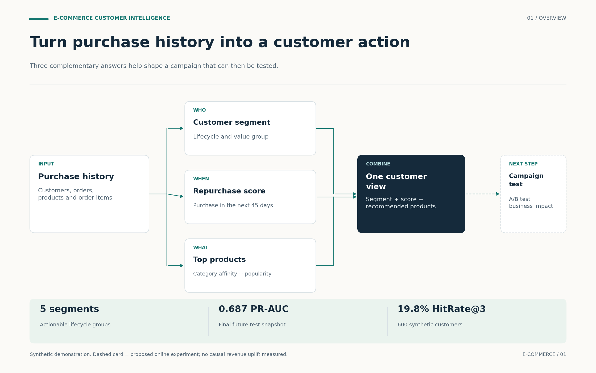
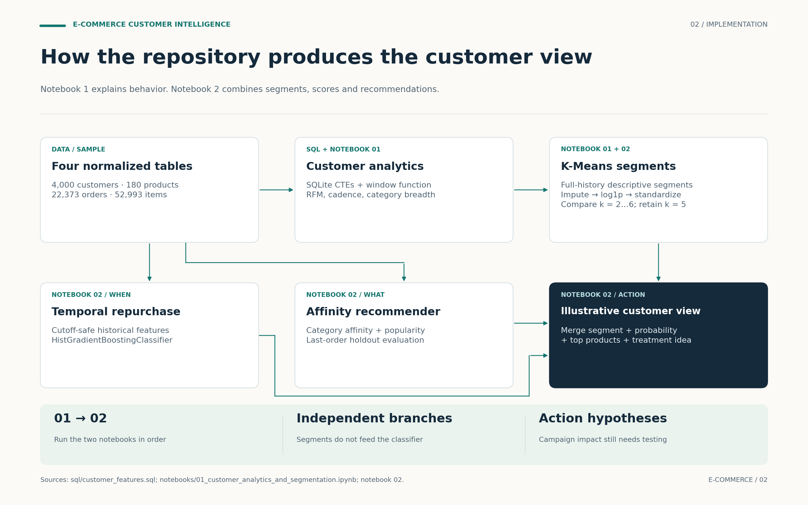
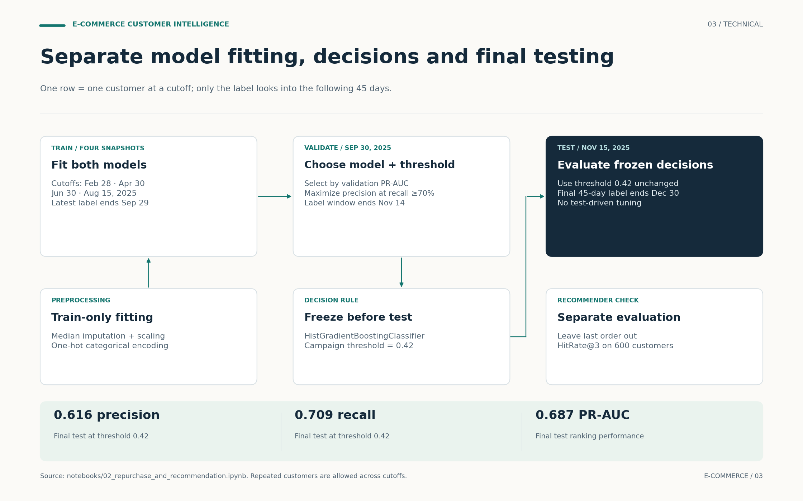

# E-commerce Customer Intelligence: visual walkthrough

Customer history branches into three complementary outputs: descriptive segments, a future repurchase score, and recommended products. They are joined into an illustrative customer view; campaign uplift remains an online experiment to run.

## 01 · Overview

Three complementary answers help shape a campaign that can then be tested.



[Editable SVG](../assets/workflows/01_overview.svg) · [PNG](../assets/workflows/01_overview.png)

## 02 · Implementation

Notebook 1 explains behavior. Notebook 2 combines segments, scores and recommendations.



[Editable SVG](../assets/workflows/02_implementation.svg) · [PNG](../assets/workflows/02_implementation.png)

## 03 · Technical

One row = one customer at a cutoff; only the label looks into the following 45 days.



[Editable SVG](../assets/workflows/03_technical.svg) · [PNG](../assets/workflows/03_technical.png)

## Implementation notes

- The repurchase classifier does not receive K-Means segment labels as features. The outputs are combined after scoring.
- Notebook 2 independently recreates the full-history descriptive segmentation shown in Notebook 1; it does not require a saved cluster-model artifact from Notebook 1.
- The SQL segmentation view uses history through December 31, 2025, while the final repurchase test cutoff is November 15. The combined customer record is illustrative and not a fully time-aligned historical campaign decision. A deployed campaign would recompute every joined output at the same cutoff. The full-history segments do not enter the classifier or its reported test metrics.
- Gradient Boosting in the README is implemented with HistGradientBoostingClassifier. Validation maximizes precision subject to recall ≥70%; the frozen threshold is 0.42.
- PR-AUC 0.687, precision 0.616 and recall 0.709 are final test values. HitRate@3 19.8% is a separate last-order holdout evaluation on 600 synthetic customers.
- Dashed campaign-test elements are proposed next steps. No deployed API, dashboard, measured advertising savings or causal revenue uplift is shown.

## Source map

| Figure | Repository evidence | What was checked |
|---|---|---|
| Overview | README.md; notebooks/02_repurchase_and_recommendation.ipynb | WHO / WHEN / WHAT outputs; synthetic offline metrics; online impact proposed |
| Implementation | sql/customer_features.sql; both notebooks | Four normalized tables; customer-grain SQL; K-Means; independent snapshot and recommendation branches |
| Technical | notebooks/02_repurchase_and_recommendation.ipynb, sections 2–9 | 45-day labels; four training cutoffs; validation model/threshold selection; frozen final test; last-order recommendation holdout |

The figures were grounded in repository commit [`04399b21112d`](https://github.com/souhiab/ecommerce-customer-intelligence/commit/04399b21112d9fb46a2bb97c4ec8f38d04e4c372). Source date: October 6, 2026. Figures are explanatory diagrams, not additional experiments.

## Files and regeneration

- `assets/workflows/`: three PNGs, three editable SVGs and one three-page PDF.
- `docs/workflow_figures.json`: labels, geometry, connections and evidence notes.
- `scripts/render_workflow_figures.py`: deterministic Matplotlib renderer using the existing project dependency.

From the repository root, run:

```bash
python scripts/render_workflow_figures.py
```

The script can also run from another directory using its absolute path. It only recreates the visual assets and does not execute or alter the research notebooks, data, models or reported metrics. Text-bound checks reject card overflow during rendering.

The shared visual language uses a warm background, dark navy decisions, project-specific accents and generous spacing. Solid connections show implemented data flow; dashed campaign-test elements mark proposed extensions. The SVG labels remain editable text.
